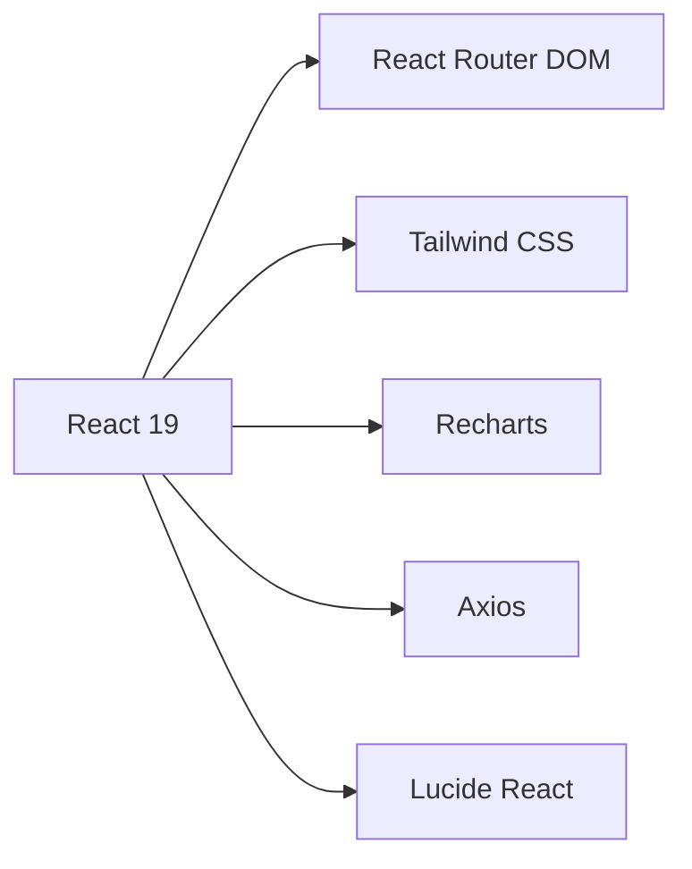

# 🎓 SOF-IA Frontend - Documentación Técnica

<div align="center">

**Sistema de Gestión Administrativa del Consultorio Jurídico**  
*Institución Universitaria de Colombia*

[Descripción](#-descripción-general) • [Tecnologías](#-tecnologías-utilizadas) • [Estructura](#-estructura-del-proyecto) • [Características](#-características-principales) • [Desarrollo](#-guía-de-desarrollo)

</div>

---

## 📖 Tabla de Contenidos

- [Descripción General](#-descripción-general)
- [Tecnologías Utilizadas](#-tecnologías-utilizadas)
- [Estructura del Proyecto](#-estructura-del-proyecto)
- [Características Principales](#-características-principales)
- [Arquitectura del Código](#-arquitectura-del-código)
- [Componentes Principales](#-componentes-principales)
- [Configuración y Variables de Entorno](#-configuración-y-variables-de-entorno)
- [Rutas y Navegación](#-rutas-y-navegación)
- [Servicios y API](#-servicios-y-api)
- [Tipos de Datos](#-tipos-de-datos)
- [Hooks Personalizados](#-hooks-personalizados)
- [Utilidades](#-utilidades)
- [Guía de Desarrollo](#-guía-de-desarrollo)

---

## 🎯 Descripción General

**SOF-IA** es un sistema de gestión administrativa diseñado específicamente para el **consultorio jurídico** de la Institución Universitaria de Colombia. 

El sistema proporciona un panel de administración completo que permite:
- ✅ Gestionar usuarios y estudiantes
- 📊 Visualizar estadísticas del sistema
- 📝 Administrar encuestas de satisfacción
- 💬 Acceso directo al chatbot de WhatsApp

> **Nota:** Aunque el sistema incluye integración con un chatbot de atención por WhatsApp, el panel administrativo NO incluye módulo de gestión de conversaciones.

---

## 🛠️ Tecnologías Utilizadas

### Core Technologies

| Tecnología | Versión | Descripción |
|------------|---------|-------------|
| **React** | 19 | Biblioteca principal para UI |
| **TypeScript** | Latest | Tipado estático para JavaScript |
| **Vite** | Latest | Build tool de próxima generación |

### Bibliotecas Principales



- **🚦 React Router DOM** - Enrutamiento declarativo
- **🎨 Tailwind CSS** - Framework CSS utilitario
- **📊 Recharts** - Biblioteca de gráficos basada en D3
- **🌐 Axios** - Cliente HTTP con promesas
- **🎯 Lucide React** - Iconos SVG optimizados
- **🔍 ESLint** - Análisis estático de código

---

## 📁 Estructura del Proyecto

```
src/
├── 🎨 assets/              # Recursos estáticos
│   ├── images/
│   └── icons/
│
├── 🧩 components/          # Componentes reutilizables
│   ├── charts/            # 📊 Componentes de gráficos
│   ├── common/            # 🔄 Elementos compartidos
│   │   ├── Button.tsx
│   │   ├── Input.tsx
│   │   ├── Modal.tsx
│   │   ├── Table.tsx
│   │   └── ...
│   └── layout/            # 🏗️ Estructura de páginas
│       ├── Sidebar.tsx
│       ├── Header.tsx
│       └── MainLayout.tsx
│
├── ⚙️ config/              # Configuraciones globales
│   ├── api.config.ts
│   └── constants.ts
│
├── 🎯 features/            # Módulos por funcionalidad
│   ├── auth/              # 🔐 Autenticación
│   ├── dashboard/         # 📊 Panel principal
│   ├── users/             # 👥 Gestión de usuarios
│   ├── surveys/           # 📝 Encuestas
│   └── students/          # 🎓 Gestión de estudiantes
│
├── 🪝 hooks/               # Custom React Hooks
│   └── useAuth.ts
│
├── 🛣️ routes/              # Configuración de rutas
│   └── index.tsx
│
├── 🌐 services/            # Servicios de API
│   ├── api.service.ts
│   └── auth.service.ts
│
├── 📝 types/               # Definiciones TypeScript
│   ├── user.types.ts
│   ├── survey.types.ts
│   └── ...
│
├── 🔧 utils/               # Funciones utilitarias
│   ├── validators.ts
│   └── formatters.ts
│
├── App.tsx
└── main.tsx
```

---

## ✨ Características Principales

### 1️⃣ Panel de Administración

```typescript
🏠 Dashboard Principal
   ├── 📈 Estadísticas generales del sistema
   ├── 📊 Gráficos interactivos
   └── 🔔 Notificaciones importantes
```

**Funcionalidades:**
- Dashboard con métricas en tiempo real
- Gestión completa de usuarios (CRUD)
- Administración de estudiantes del consultorio jurídico
- Visualización y análisis de encuestas de satisfacción

### 2️⃣ Sistema de Autenticación

| Característica | Implementación |
|----------------|----------------|
| **Login** | Credenciales predeterminadas |
| **Protección de Rutas** | Guards de autenticación |
| **Persistencia** | LocalStorage con tokens |
| **Seguridad** | Interceptores HTTP |

### 3️⃣ Interfaz de Usuario

> 🎨 **Diseño Moderno y Responsive**

- ✅ **Responsive Design** - Adaptable a todos los dispositivos
- 🧩 **Componentes Reutilizables** - Inputs, botones, tablas, modales
- 📊 **Gráficos Interactivos** - Visualización de datos con Recharts
- 🔔 **Sistema de Notificaciones** - Feedback visual en tiempo real
- ♿ **Accesibilidad** - Cumple con estándares WCAG

### 4️⃣ Integración con Chatbot

```
┌─────────────────────────────────┐
│   Panel Administrativo SOF-IA   │
│                                 │
│  ┌───────────────────────────┐ │
│  │  Botón WhatsApp Chatbot   │ │
│  └───────────┬───────────────┘ │
│              │                  │
└──────────────┼──────────────────┘
               │
               ▼
        🤖 Chatbot WhatsApp
```

---

## 🏗️ Arquitectura del Código

### Patrones de Diseño

<table>
<tr>
<td width="50%">

**🔷 Componentes Funcionales**
```typescript
// Uso de React Hooks
const MyComponent = () => {
  const [state, setState] = useState()
  useEffect(() => { ... })
  return <div>...</div>
}
```

</td>
<td width="50%">

**🔷 Separación de Responsabilidades**
```
Component → Hook → Service → API
   UI     Logic   Business  Network
```

</td>
</tr>
</table>

### Principios Aplicados

- 📦 **Modularidad** - Componentes pequeños y enfocados
- 🔄 **Reutilización** - DRY (Don't Repeat Yourself)
- 📝 **Tipado Fuerte** - TypeScript en todo el código
- 🎯 **Single Responsibility** - Una responsabilidad por componente
- 🔌 **Separation of Concerns** - Lógica separada de presentación

### Organización por Funcionalidad

```
features/
├── [feature-name]/
│   ├── components/          # Componentes específicos
│   ├── hooks/              # Hooks del módulo
│   ├── services/           # Servicios API
│   ├── types/              # Tipos TypeScript
│   ├── utils/              # Utilidades del módulo
│   └── [Feature]Page.tsx   # Componente principal
```

---

## 🧩 Componentes Principales

### 🏗️ Componentes de Layout

#### `MainLayout`
**Descripción:** Estructura principal de la aplicación
```typescript
<MainLayout>
  <Sidebar />
  <div className="main-content">
    <Header />
    <Outlet /> {/* Rutas anidadas */}
  </div>
</MainLayout>
```

#### `Sidebar`
**Características:**
- 🧭 Navegación principal
- 🎨 Indicador de página activa
- 📱 Modo colapsable (responsive)

#### `Header`
**Elementos:**
- 👤 Información del usuario
- 🔔 Notificaciones
- 🚪 Botón de logout

---

### 🔄 Componentes Comunes

<details>
<summary><b>📘 Ver todos los componentes disponibles</b></summary>

| Componente | Descripción | Props Principales |
|------------|-------------|-------------------|
| `Button` | Botón reutilizable | `variant`, `size`, `disabled`, `loading` |
| `Input` | Campo de entrada | `type`, `icon`, `error`, `placeholder` |
| `Card` | Contenedor con estilo | `title`, `subtitle`, `actions` |
| `Table` | Tabla de datos | `columns`, `data`, `onRowClick` |
| `Modal` | Ventana emergente | `isOpen`, `onClose`, `title` |
| `Pagination` | Paginación de datos | `currentPage`, `totalPages`, `onPageChange` |
| `SearchBar` | Barra de búsqueda | `value`, `onChange`, `placeholder` |
| `StatusBadge` | Indicador de estado | `status`, `variant` |

</details>

#### Ejemplo de Uso: Button Component

```typescript
// Variantes disponibles
<Button variant="primary">Guardar</Button>
<Button variant="secondary">Cancelar</Button>
<Button variant="danger" icon={<Trash />}>Eliminar</Button>
<Button variant="ghost" loading={true}>Cargando...</Button>
```

---

### 📊 Componentes de Gráficos

#### `LineChart` - Gráfico de Líneas
**Uso:** Visualización de tendencias temporales

```typescript
<LineChart 
  data={monthlyData}
  xAxis="month"
  yAxis="value"
  color="#3b82f6"
/>
```

#### `BarChart` - Gráfico de Barras
**Uso:** Comparación de valores

```typescript
<BarChart 
  data={categoryData}
  xAxis="category"
  yAxis="count"
  color="#10b981"
/>
```

---

## ⚙️ Configuración y Variables de Entorno

### 📄 Archivo `.env`

```bash
# API Configuration
VITE_API_URL=http://localhost:3000/api

# Chatbot Integration
VITE_CHATBOT_URL=https://web.whatsapp.com

# Environment
VITE_ENV=development
```

### 🔧 Configuración Principal

```typescript
// config/api.config.ts
export const API_CONFIG = {
  BASE_URL: import.meta.env.VITE_API_URL,
  TIMEOUT: 10000,
  HEADERS: {
    'Content-Type': 'application/json'
  }
}

// config/constants.ts
export const DEFAULT_ADMIN = {
  email: 'admin@sofia.com',
  password: 'admin123'
}

export const CHATBOT_CONFIG = {
  URL: import.meta.env.VITE_CHATBOT_URL,
  PHONE: '+57123456789'
}
```

---

## 🛣️ Rutas y Navegación

### Mapa de Rutas

```
/ (root)
├── /login                    # 🔐 Página de inicio de sesión
└── /admin (Protected)        # 🔒 Rutas protegidas
    ├── /dashboard            # 📊 Dashboard principal
    ├── /users                # 👥 Gestión de usuarios
    │   ├── /users/new        # ➕ Crear usuario
    │   └── /users/:id        # ✏️ Editar usuario
    ├── /surveys              # 📝 Encuestas de satisfacción
    └── /students             # 🎓 Gestión de estudiantes
        ├── /students/new     # ➕ Crear estudiante
        └── /students/:id     # ✏️ Editar estudiante
```

### 🔒 Protección de Rutas

```typescript
// Implementación del ProtectedRoute
<Route element={<ProtectedRoute />}>
  <Route path="/dashboard" element={<DashboardPage />} />
  <Route path="/users" element={<UsersPage />} />
  {/* ... más rutas protegidas */}
</Route>
```

**Comportamiento:**
- ✅ Usuario autenticado → Acceso permitido
- ❌ Usuario no autenticado → Redirección a `/login`

---

## 🌐 Servicios y API

### 🔐 Servicio de Autenticación

**Archivo:** `services/auth.service.ts`

<table>
<tr>
<th>Método</th>
<th>Descripción</th>
<th>Parámetros</th>
<th>Retorno</th>
</tr>
<tr>
<td><code>login()</code></td>
<td>Inicia sesión</td>
<td>email, password</td>
<td>Promise&lt;User&gt;</td>
</tr>
<tr>
<td><code>logout()</code></td>
<td>Cierra sesión</td>
<td>-</td>
<td>void</td>
</tr>
<tr>
<td><code>getCurrentUser()</code></td>
<td>Usuario actual</td>
<td>-</td>
<td>User | null</td>
</tr>
<tr>
<td><code>isAuthenticated()</code></td>
<td>Verifica sesión</td>
<td>-</td>
<td>boolean</td>
</tr>
</table>

### 🔌 Servicio de API

**Archivo:** `services/api.service.ts`

```typescript
class ApiService {
  // Métodos HTTP
  async get<T>(endpoint: string, params?: object): Promise<T>
  async post<T>(endpoint: string, data: object): Promise<T>
  async put<T>(endpoint: string, data: object): Promise<T>
  async delete<T>(endpoint: string): Promise<T>
}
```

**Interceptores configurados:**
- 📤 **Request:** Añade token de autenticación
- 📥 **Response:** Manejo centralizado de errores
- 🔄 **Retry:** Reintento automático en fallos de red

---

## 📝 Tipos de Datos

### Interfaces Principales

#### 👤 User

```typescript
interface User {
  id: string
  name: string
  email: string
  role: UserRole
  status: UserStatus
  createdAt: Date
  updatedAt: Date
}
```

#### 📋 Survey

```typescript
interface Survey {
  id: string
  userId: string
  rating: number          // 1-5
  comment?: string
  category: SurveyCategory
  createdAt: Date
}
```

#### 🎓 Student

```typescript
interface Student {
  id: string
  documentNumber: string
  firstName: string
  lastName: string
  email: string
  phone: string
  program: string
  semester: number
  status: StudentStatus
  createdAt: Date
}
```

#### 🔄 ApiResponse

```typescript
interface ApiResponse<T> {
  success: boolean
  data: T
  message?: string
  errors?: ValidationError[]
}
```

### Enumeraciones

```typescript
// Roles de usuario
enum UserRole {
  ADMINISTRADOR = 'ADMINISTRADOR',
  ESTUDIANTE = 'ESTUDIANTE',
  INACTIVO = 'INACTIVO'
}

// Estados
enum UserStatus {
  ACTIVO = 'ACTIVO',
  INACTIVO = 'INACTIVO'
}

enum StudentStatus {
  ACTIVO = 'ACTIVO',
  GRADUADO = 'GRADUADO',
  RETIRADO = 'RETIRADO'
}
```

---

## 🪝 Hooks Personalizados

### `useAuth`

**Hook principal para gestión de autenticación**

```typescript
const {
  user,              // Usuario actual
  isAuthenticated,   // Estado de autenticación
  loading,           // Estado de carga
  login,             // Función de login
  logout,            // Función de logout
  checkAuth          // Verificar autenticación
} = useAuth()
```

**Ejemplo de uso:**

```typescript
function LoginPage() {
  const { login, loading } = useAuth()
  
  const handleSubmit = async (credentials) => {
    try {
      await login(credentials.email, credentials.password)
      navigate('/dashboard')
    } catch (error) {
      showError(error.message)
    }
  }
  
  return <LoginForm onSubmit={handleSubmit} loading={loading} />
}
```

---

## 🔧 Utilidades

### ✅ Validadores (`utils/validators.ts`)

<table>
<tr>
<th>Función</th>
<th>Descripción</th>
<th>Ejemplo</th>
</tr>
<tr>
<td><code>isValidEmail()</code></td>
<td>Valida formato email</td>
<td><code>isValidEmail('user@mail.com')</code></td>
</tr>
<tr>
<td><code>isValidDocument()</code></td>
<td>Valida cédula colombiana</td>
<td><code>isValidDocument('1234567890')</code></td>
</tr>
<tr>
<td><code>isValidPhone()</code></td>
<td>Valida teléfono</td>
<td><code>isValidPhone('3001234567')</code></td>
</tr>
<tr>
<td><code>isNotEmpty()</code></td>
<td>Verifica string no vacío</td>
<td><code>isNotEmpty('texto')</code></td>
</tr>
<tr>
<td><code>hasMinLength()</code></td>
<td>Valida longitud mínima</td>
<td><code>hasMinLength('pass', 8)</code></td>
</tr>
</table>

### 📐 Formateadores (`utils/formatters.ts`)

```typescript
// Formateo de números
formatNumber(1234567)           // "1,234,567"

// Formateo de fechas
formatDate(new Date())          // "08 Feb 2026"
formatDateTime(new Date())      // "08 Feb 2026, 10:30 AM"

// Formateo de porcentajes
formatPercentage(0.8563)        // "85.63%"

// Truncar texto
truncateText("Lorem ipsum...", 10)  // "Lorem ipsu..."
```

---

## 🚀 Guía de Desarrollo

### 📦 Scripts Disponibles

```bash
# Desarrollo
npm run dev              # Inicia servidor de desarrollo

# Construcción
npm run build            # Genera build de producción
npm run preview          # Previsualiza build

# Calidad de código
npm run lint             # Ejecuta ESLint
npm run lint:fix         # Corrige errores automáticamente
npm run type-check       # Verifica tipos TypeScript
```

### 📋 Convenciones de Código

#### Nomenclatura

```typescript
// ✅ Variables y funciones: camelCase
const userName = 'John'
function getUserData() { }

// ✅ Componentes y Clases: PascalCase
class UserService { }
function UserCard() { }

// ✅ Constantes: UPPER_SNAKE_CASE
const API_BASE_URL = 'https://api.example.com'

// ✅ Archivos: kebab-case (con extensión apropiada)
user-profile.tsx
auth.service.ts
user.types.ts
```

#### Estructura de Archivos

```typescript
// ✅ Componentes React
ComponentName.tsx       // Componente con JSX

// ✅ Servicios
service-name.service.ts

// ✅ Tipos
entity-name.types.ts

// ✅ Utilidades
utility-name.utils.ts
```

### 🎯 Alias de Importación

```typescript
// tsconfig.json configurado con paths
import { Button } from '@/components/common'
import { useAuth } from '@/hooks'
import { UserService } from '@/services'
import type { User } from '@/types'
```

**Alias disponibles:**
- `@/*` → `src/*`
- `@components/*` → `src/components/*`
- `@features/*` → `src/features/*`
- `@services/*` → `src/services/*`
- `@hooks/*` → `src/hooks/*`
- `@utils/*` → `src/utils/*`
- `@types/*` → `src/types/*`

### ✨ Buenas Prácticas

#### 1. Componentes Pequeños y Enfocados

```typescript
// ❌ Evitar
function UserDashboard() {
  // 500 líneas de código...
}

// ✅ Preferir
function UserDashboard() {
  return (
    <>
      <UserHeader />
      <UserStats />
      <UserActivity />
    </>
  )
}
```

#### 2. Separación de Lógica

```typescript
// ❌ Lógica en el componente
function UserList() {
  const [users, setUsers] = useState([])
  
  useEffect(() => {
    fetch('/api/users')
      .then(res => res.json())
      .then(setUsers)
  }, [])
  
  return <div>{/* ... */}</div>
}

// ✅ Lógica en custom hook
function UserList() {
  const { users, loading, error } = useUsers()
  
  if (loading) return <Spinner />
  if (error) return <Error message={error} />
  
  return <UserTable data={users} />
}
```

#### 3. Tipado Estricto

```typescript
// ❌ Tipos implícitos
function updateUser(id, data) {
  // ...
}

// ✅ Tipos explícitos
function updateUser(id: string, data: Partial<User>): Promise<User> {
  // ...
}
```

#### 4. Manejo de Estados

```typescript
// Estados de carga, error y datos
interface DataState<T> {
  data: T | null
  loading: boolean
  error: string | null
}

function useData<T>(fetcher: () => Promise<T>) {
  const [state, setState] = useState<DataState<T>>({
    data: null,
    loading: true,
    error: null
  })
  
  // ...
}
```

#### 5. Componentes Accesibles

```typescript
// ✅ Accesibilidad incorporada
<button
  aria-label="Cerrar modal"
  onClick={onClose}
  disabled={loading}
>
  <X aria-hidden="true" />
</button>

<input
  type="text"
  aria-invalid={!!error}
  aria-describedby={error ? "error-message" : undefined}
/>
{error && <span id="error-message" role="alert">{error}</span>}
```

### 🏗️ Estructura Recomendada para Nuevas Features

```
features/
└── nueva-feature/
    ├── components/
    │   ├── FeatureList.tsx
    │   ├── FeatureForm.tsx
    │   └── FeatureCard.tsx
    ├── hooks/
    │   └── useFeature.ts
    ├── services/
    │   └── feature.service.ts
    ├── types/
    │   └── feature.types.ts
    ├── utils/
    │   └── feature.utils.ts
    └── FeaturePage.tsx
```

### 📚 Recursos Adicionales

- 📖 [React Documentation](https://react.dev)
- 📘 [TypeScript Handbook](https://www.typescriptlang.org/docs/)
- 🎨 [Tailwind CSS Docs](https://tailwindcss.com/docs)
- 🚦 [React Router Docs](https://reactrouter.com)

---

<div align="center">

### 🎉 ¡Listo para Desarrollar!

**SOF-IA Frontend** está construido con las mejores prácticas y tecnologías modernas.

Si encuentras algún problema o tienes sugerencias, no dudes en abrir un issue.

---

*Documentación actualizada - Febrero 2026*

</div>
